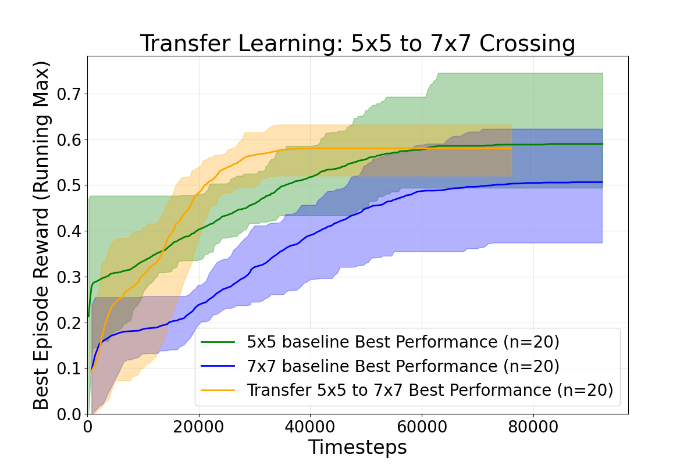
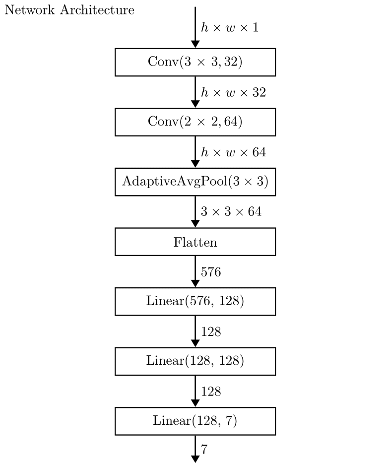

# Grid World Transfer Learning -​ from Small to Big Challenges



This project strides toward showing the power of Transfer Learning. And how Transfer Learning can save computation time if models trained on lower complexity enviroments are available. In our example we chose the [Crossing](https://minigrid.farama.org/environments/minigrid/CrossingEnv/) env from [MiniGrid](https://minigrid.farama.org/). As the agent we choose the preimplemented [DQN Agent](https://stable-baselines3.readthedocs.io/en/master/modules/dqn.html) from [Stable Baselines3](https://stable-baselines3.readthedocs.io/en/master/index.html) and inserted our own Neural Network into it.

In the plot above we tracked the running max (histprical max) Episode reward of our models. We ran 20 runs with random seeds per experiment and plotted to mean curve for our three experiments and the band is our 95% confidence interval. 
We trained two baselines, one is the baseline on the simple env with size 5x5 (green) and the otehr one on the same env but with size 7x7 (blue). We trained both on 100_000 Steps. Our third experiment is our transfer of the 5x5 models to a 7x7 enviroment trained on 80_000 steps.
In the plot we can see that in an interval of ~[18_000, 44_000] the Transfer Lerning outperforms the 7x7 baseline with the confidence bands not touching. Although the mean of the transfer learning is almost allways higher than the one of the 7x7 baseline, this interval shows not intersection and thereby is with high certainty realy better than the baseline (training from scratch).


# Instalation

Clone the repository:
```bash
git clone https://github.com/F10rian/RL_Project.git
```

Installing [uv](https://docs.astral.sh/uv/):
```bash
pip install uv
```

To activate the uv env:
```bash
source .venv/bin/activate
```
In Windows:

```powershell
.venv\Scripts\activate
```

To get all the librarys:
```powershell
uv sync
```


## Training Agents

From scratch training (Baseline):
```bash
python src/training/train.py --mode train --env MiniGrid-Crossing-5x5-v0 --tensorboard_log logging/log_baseline_5x5 --num_models 20 --batch_size 512 --buffer_size 100_000 --lr 1e-4 --exp_init_eps 0.5 --exp_fraction 0.8 --verbose 0
```

Fine Tuning (model_path is required):
```bash
python src/training/train.py --mode finetune --env MiniGrid-Crossing-7x7-v0 --model_path logging/log_baseline_5x5/sqn_5x5_0 --tensorboard_log logging/log_transfer_5x5_to_7x7 --num_models 20 --batch_size 512 --buffer_size 100_000 --lr 1e-4 --exp_init_eps 0.5 --exp_fraction 0.8 --verbose 0
```

Fine Tuning sweep (the sweep list is hardcoded in train, those are the models):
```bash
python src/training/train.py --mode finetune_sweep --env MiniGrid-Crossing-7x7-v0 --tensorboard_log logging/log_transfer_5x5_to_7x7 --num_models 20 --batch_size 512 --buffer_size 100_000 --lr 1e-4 --exp_init_eps 0.5 --exp_fraction 0.8 --verbose 0
```


# Ploting

Ploting the mean episode reward with min max band:
```bash
python src/evaluation/plot_mean.py logging/log_baseline_5x5 "5x5 baseline" logging/log_baseline_7x7 "7x7 baseline" logging/log_transfer_5x5_to_7x7 "Transfer 5x5 to 7x7"
```

Ploting the running max over mean episode reward with 95% confidence band:
```bash
python src/evaluation/plot_mean_running_max.py logging/log_baseline_5x5 "5x5 baseline" logging/log_baseline_7x7 "7x7 baseline" logging/log_transfer_5x5_to_7x7 "Transfer 5x5 to 7x7"
```


# Network Architecture 



This is the Network architecture of our DQN. The terminolagy for Conv layers is Conv(Kernel size, Feature Maps Out), AdaptiveAvgPooling means a pooling from dimensions of [h, w, x] to [k, k, x] with k beeing the input of AadptiveAvgPooling. Input to the entwork is a representation of the env and output is the 7 possible actions (from which only 3 are used in this env).


# Using uv

Hier eine Kurse Übersicht der wichtigsten Befehle:

- `uv sync`: Sync the project's dependencies with the environment. (Bitte immer als erstes nach dem pull ausführen, damit wir alle auf dem selben Stand sind)
- `uv add`: Add a dependency to the project.
- `uv remove`: Remove a dependency from the project.


### Add new package

Package erstellen
```bash
uv init --package name-of-package
```

Unsere packages können wir einfach dem package Ordner hinzufügen und mit dem folgenden Befehl zu einem uv package machen:

```bash
uv pip install -e /path/to/name-of-package
```

Dabei ist wichtig, dass euer package-Name nicht mit Unterstrich (\_), sondern Bindestrich (-) geschrieben wird, damit uv das unterschieden kann. Ab dann können wir alle unsere packages einfach mit "name_of_package" in unsere Dateien importieren.

