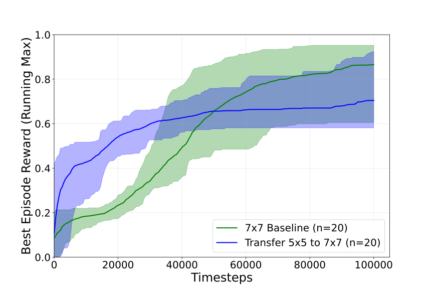

# Grid World Transfer Learning -​ from Small to Big Challenges


<table>
  <tr>
    <td></td>
    <td></td>
  </tr>
  <tr>
    <td align="center">Transfer learning to 7x7</td>
    <td align="center">Transfer learning to 9x9</td>
  </tr>
</table>

This project strides toward showing the power of Transfer Learning and Curriculum Learning. And how Transfer Learning can save computation time if models trained on lower complexity enviroments are available. In our example we chose the [Crossing](https://minigrid.farama.org/environments/minigrid/CrossingEnv/) env from [MiniGrid](https://minigrid.farama.org/). As the agent we choose the preimplemented [DQN Agent](https://stable-baselines3.readthedocs.io/en/master/modules/dqn.html) from [Stable Baselines3](https://stable-baselines3.readthedocs.io/en/master/index.html) and inserted our own Neural Network into it.

In the plots above we tracked the running max (historical max) Episode reward of our models. We ran 20 runs with random seeds per experiment and plotted to mean curve for our three experiments and the band is our 95% confidence interval. 

With the transfer models and the curriculum models we can see that they have good values way before their baseline models (learning the same enviroment from scratch).

# Instalation

Clone the repository:
```bash
git clone https://github.com/F10rian/RL_Project.git
```

Installing [uv](https://docs.astral.sh/uv/):
```bash
pip install uv
```

To activate the uv env:
```bash
source .venv/bin/activate
```
In Windows:

```powershell
.venv\Scripts\activate
```

To get all the librarys:
```powershell
uv sync
```

## Training Agents

From scratch training (Baseline):
```bash
python test2.py --mode train --env MiniGrid-Crossing-5x5-v0 --tensorboard_log log_baseline_5x5 --num_models 20 --batch_size 512 --buffer_size 100_000 --lr 5e-4 --exp_init_eps 1.0 --exp_fraction 0.8 --steps 100_000 --verbos 0
```

Fine Tuning (model_path is required):
```bash
python test2.py --mode finetune --env MiniGrid-Crossing-7x7-v0 --model_path log_baseline_5x5/MiniGrid-Crossing-5x5-v0_0 --tensorboard_log log_transfer_5x5_to_7x7 --batch_size 512 --buffer_size 100_000 --lr 1e-4 --exp_init_eps 0.5 --exp_fraction 0.8 --steps 100_000 --verbos 0
```

Fine Tuning sweep (the sweep list is hardcoded in test2, those are the models):
```bash
python test2.py --mode finetune_sweep --env MiniGrid-Crossing-7x7-v0 --tensorboard_log log_transfer_5x5_to_7x7 --batch_size 512 --buffer_size 100_000 --lr 1e-4 --exp_init_eps 0.5 --exp_fraction 0.8 --steps 100_000 --verbos 0
```

# Ploting

Ploting the running max over mean episode reward with 95% confidence band:
```bash
python .\plotting\plot_mean_running_max.py .\log_baseline_5x5\ "5x5 Baseline" .\log_baseline_7x7 "7x7 Baseline" .\log_transfer_5x5_to_7x7\ "Transfer 5x5 to 7x7"
```

Ploting the mean episode reward with min max band:
```bash
python .\plotting\plot_mean.py .\log_baseline_5x5\ "5x5 Baseline" .\log_baseline_7x7 "7x7 Baseline" .\log_transfer_5x5_to_7x7\ "Transfer 5x5 to 7x7"
```


## Network Architecture 


This is the Network architecture of our DQN. The terminolagy for Conv layers is Conv(Kernel size, Feature Maps Out), AdaptiveAvgPooling means a pooling from dimensions of [h, w, x] to [k, k, x] with k beeing the input of AadptiveAvgPooling. Input to the entwork is a representation of the env and output is the 7 possible actions (from which only 3 are used in this env).
